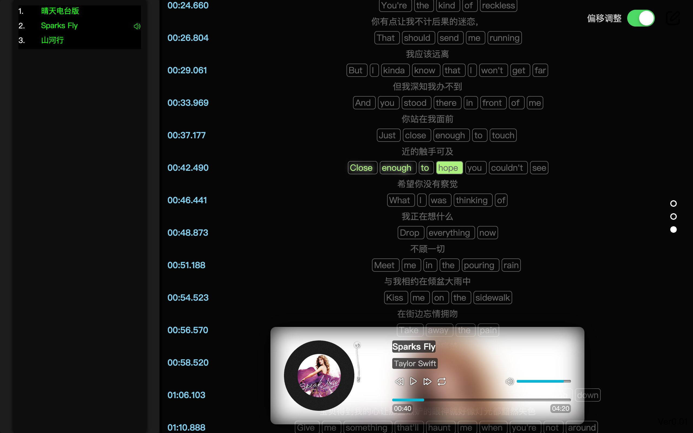

# 概述
没找到好用的歌词偏移调整工具，所以自己写了一个，基本功能正常，但可能有小bug
## 功能：
1. 网页播放音乐，仅在edge上测试
2. 数据由后台的python提供
3. 支持普通lrc歌词显示、调整偏移、新建
4. 支持逐字歌词显示、调整偏移、新建、保存
5. 英文部分歌词去*、歌词时间格式验证及修正/提醒
6. 支持双语歌词
7. 歌曲格式支持：flac、mp3
## 备注：
* 部分代码来源网络

# 安装：
python3
## python3 依赖模块
```bash
pip3 install mutagen flask flask_cors urllib
```

# 运行
## server/server.py
这是一个简单的后台服务，用于为网页提供数据，运行：
```bash
python3 server.py
```
运行后会在当前目录下生成datas文件夹【如果没有就先运行一次再Ctrl+c停止就会自动生成】，其中
1. music 请将音乐放在这里
2. lyrics 歌词放在这里，要与歌曲同名，后缀.lrc；如果有内嵌歌词可以忽略（会自动生成）
3. covers 歌曲内嵌封面（会自动生成）
4. lyrics_new 调整歌词偏移或新建歌词切歌后可以自动保存在这里

## index.html
网页端直接运行就会自动从以上获取数据

# 功能及操作方法
## 按钮/快捷键
### 全局
| 类别 | 目标 | 功能 |
|---|---|---|
| 方向键 | 上 | 切换到上一首歌并保存歌词到lyrics_new |
| 方向键 | 下 | 切换到下一首歌并保存歌词到lyrics_new |
| 按键 | Shift | 播放/暂停 |
| 按钮 | 右上角绿色开关 | 绿色状态会保存歌词，否则不会保存 |
| 按钮 | 黑色按钮 | 对应不同页面，分别存储对应的歌词原文本 |

### 播放界面
| 类别 | 目标 | 功能 |
|---|---|---|
| 方向键 | 左 | 偏移-0.1秒 |
| 方向键 | 左长按 | 偏移-加速 |
| 方向键 | 右 | 偏移+0.1秒 |
| 方向键 | 右长按 | 偏移+加速 |

### lrc界面
| 类别 | 目标 | 功能 |
|---|---|---|
| 方向键 | 左 | 进度条退回5秒 |
| 方向键 | 左长按 | 进度条退回加速 |
| 方向键 | 右 | 进度条快进5秒 |
| 方向键 | 右长按 | 进度条快进加速 |
| 鼠标 | 左键点击歌词行 | 进度条跳转到对应的时间-1.5秒，并标记其为目标行 |
| 鼠标 | 左键点击播放面板 | 开始记录歌词时间（单行） |
| 鼠标 | 右键点击播放面板 | 开始记录歌词时间（双行） 一般用于有翻译的歌词|
| 按键 | x/X | 清除目标行的格式 |

### 增强lrc界面
| 类别 | 目标 | 功能 |
|---|---|---|
| 方向键 | 左 | 进度条退回1秒 |
| 方向键 | 左长按 | 进度条退回加速 |
| 方向键 | 右 | 进度条快进1秒 |
| 方向键 | 右长按 | 进度条快进加速 |
| 鼠标 | 左键点击歌词行 | 进度条跳转到对应的时间-1.5秒，并标记其为目标行 |
| 鼠标 | 左键点击播放面板-按下 | 开始记录逐字歌词开始时间 |
| 鼠标 | 左键点击播放面板-抬起 | 开始记录逐字歌词结束时间 |
| 按键 | x/X | 清除目标行的格式 |

鼠标抬起和按下的间隔时间会自动计算并平分到前后的文字时间中

# 支持的逐字歌词格式
## 单行
```text
[01:00.974]<01:00.974>花<01:01.183>落<01:01.390>的<01:01.646>那<01:01.870>一<01:02.238>天<01:02.538>
[01:02.743]<01:02.743>教<01:02.927>室<01:03.126>的<01:03.374>那<01:03.622>一<01:03.990>间<01:04.234>
[01:04.458]<01:04.458>我<01:04.652>怎<01:04.838>么<01:05.082>看<01:05.410>不<01:05.722>见<01:06.044>
[01:06.265]<01:06.265>消<01:06.435>失<01:06.610>的<01:06.878>下<01:07.137>雨<01:07.451>天<01:07.762>
[01:07.953]<01:07.953>我<01:08.137>好<01:08.324>想<01:08.578>再<01:08.802>淋<01:09.009>一<01:09.229>遍<01:11.404>
[01:12.132]<01:12.132>没<01:12.340>想<01:12.525>到<01:12.708>失<01:13.004>去<01:13.436>的<01:13.892>勇<01:14.316>气<01:14.742>我<01:15.136>还<01:15.535>留<01:16.020>着<01:17.488>
```
## 双行
```text
[00:17.326]<00:17.326>The <00:17.552>way <00:17.768>you <00:17.988>move <00:18.259>is <00:18.495>like <00:18.790>a <00:18.982>full <00:19.413>on <00:19.876>rainstorm<00:21.097>
[00:17.326]你的一举一动都如暴风雨般让我刻骨铭心
[00:21.444]<00:21.444>And <00:21.630>I'm <00:21.825>a <00:22.062>house <00:22.612>of <00:22.925>cards<00:23.792>
[00:21.444]而我就像纸牌搭起的房子脆弱，轻易被攻陷
```

# 运行截图
## 播放界面
### 单行lrc歌词

### 双行 逐字歌词

## lrc歌词新建/编辑界面
### 单语歌词 lrc

### 双语歌词 逐字

## 逐字歌词界面
### 逐字歌词 单行


### 逐字歌词 双行



# 当前存在的问题
1. 仅支持中英简单的分词，可能有小问题
    【当前分词的目标在于保持人唱歌的节奏，一个字对应鼠标点一下，唱的越久鼠标按的越久，这样熟悉的歌可以提高逐字歌词的准确度】